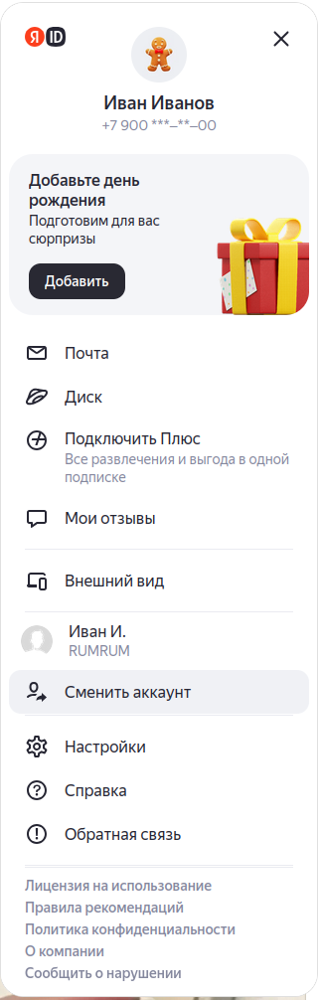
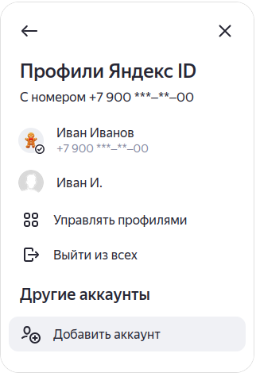
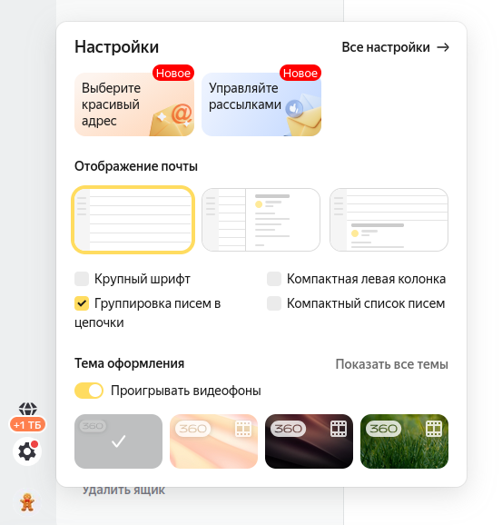
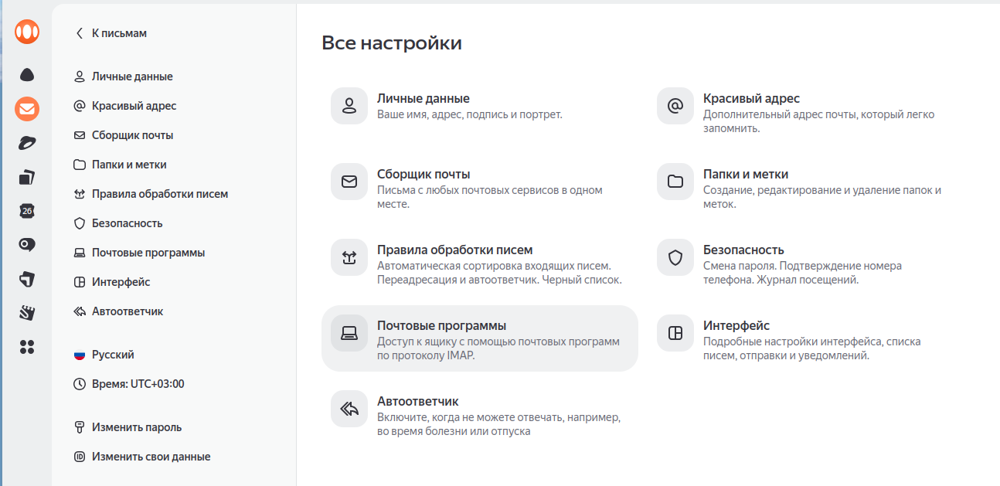
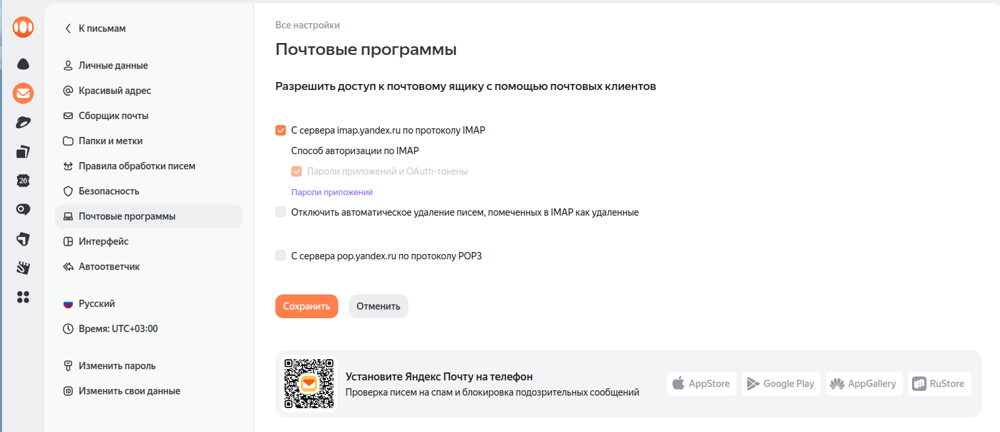
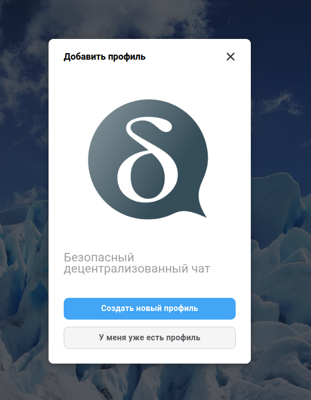
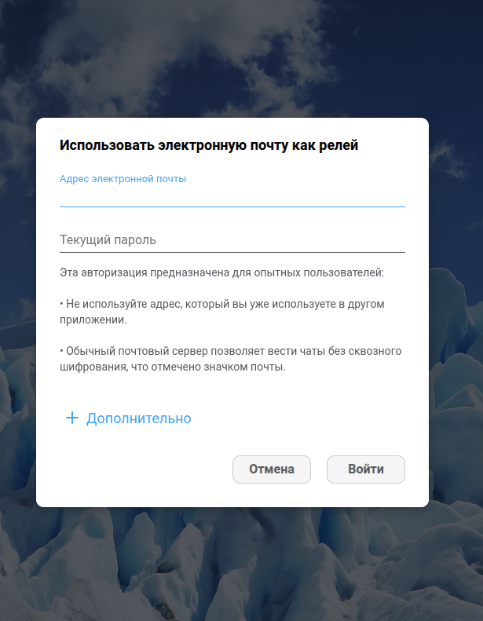

# Подключение DeltaChat к Яндекс.Почте

## Настройка Яндекс.Почты для работы с DeltaChat

Для начала вам нужна отдельная почта. Для этого идем в свой яндекс-аккаунт в браузере на ya.ru, в правом углу нажимаем на иконку профиля и в меню выбираем *Сменить аккаунт*.  

Далее в новом, но таком же меню - *Добавить аккаунт*.  

Здесь следуем подсказкам сиситем и создаем новый аккаунт почты на то же телефон, что и текущий аккаунт. Можно просто добавить **deltachat.** к текущему имени аккаунта, например если ваш аккаунт называется **ivanov**, то новый будет **deltachat.ivanov**.  
После создания нового аккаунта, заходим в него и открываем почту. Возможно Яндекс предолжит еще раз создать этот аккаунт - не удивляйтесь - просто сново введите выбранное имя аккаунта (**deltachat.ivanov**) и повторите пароль. Просто интерфейс яндекса чрезвычайно плох.  
В левом нижнем углу нажимаем на иконку шестеренки и в меню выбираем *Все настройки*.  

На странице настрое к выбираем пункт *Почтовые программы*.  

На открывшейся странице отметьте галочку *С сервера imap.yandex.ru по протоколу IMAP*.  

После этого нажмите на кнопку *Сохранить* внизу страницы.  
Далее нужно создать пароль для подключения дельта чат:  
1 Откройте вкладку [Безопасность](https://id.yandex.ru/security)  
2 В разделе *Доступ к вашим данным* выберите *Пароли приложений*.
3 В подразделе *Создать пароль приложения* нажмите на плюсик в пункте Почта.
4 В открывшемся окошке введите DeltaChat в качестве названия приложения и нажмите кнопку *Далее*.  
5 В открывашемся окне вам будет показан пароль для подключения к почте. Скопируйте его и сохраните в надежном месте, так как он будет показан только один раз.

## Настройка DeltaChat для работы с Яндекс.Почтой

Откройте DeltaChat и нажмите на кнопку *Добавить аккаунт*.  

Нажмите на кнопку *Создать новый профиль*.  
Здесь у вас будет запрошено имя профиля - ничего не вводите. Просто нажмите кнопку *Использовать другой сервер*. В открывашемся окне выбирите *Использовать электронную почту как релей*.
В следующем окне просто введите электронную почту, которую вы создали для дельта чата и скопированный пароль для подключения к почте (не основной пароль от яндекс аккаунта, а именно пароль для подключения к почте, который вы создали в предыдущем разделе).  

Нажмите кнопку *Войти*.  
Радуйтесь!